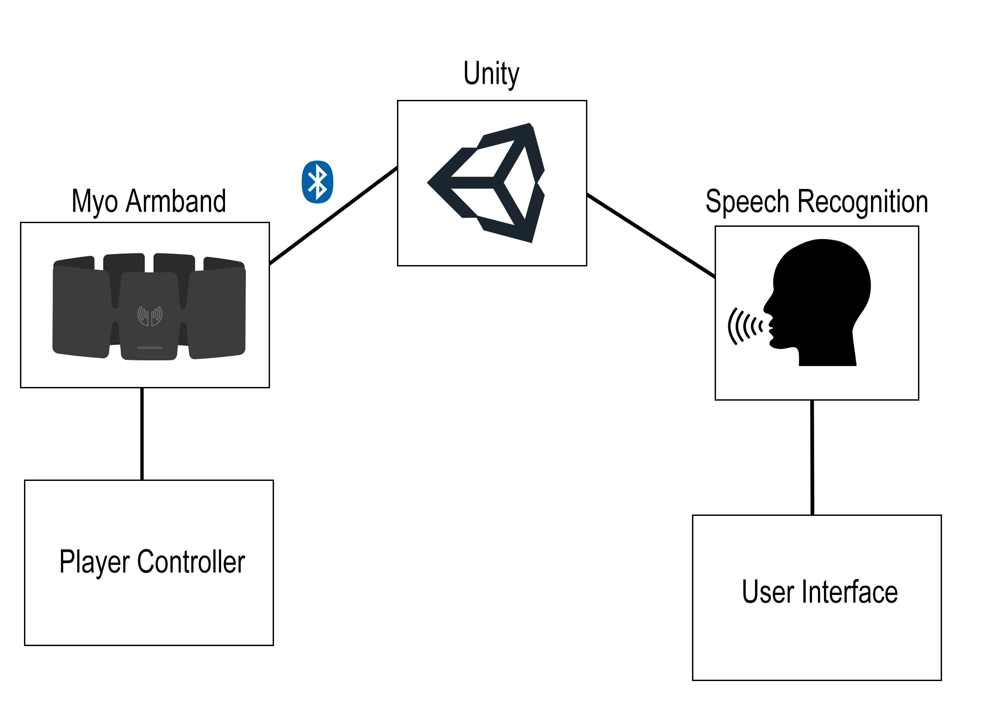
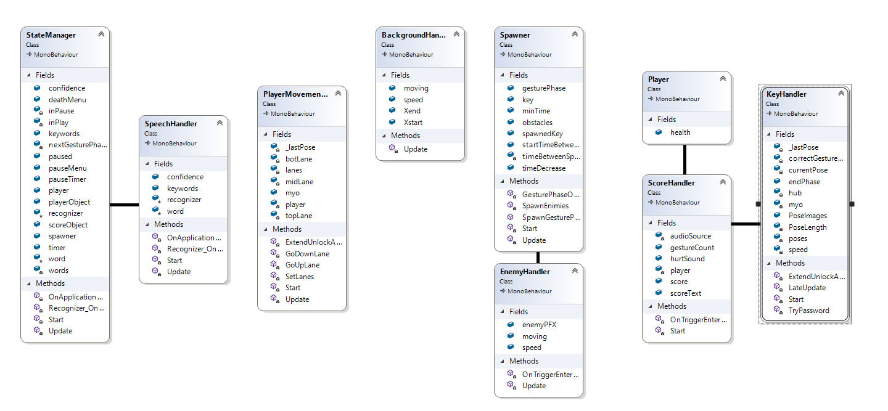

# Gesture Based Project

2D Gesture Based Endless Runner

## Goal
The main goal is to traverse through enemies and to replicate gestures presented on screen to live as long as possible.

## Gameplay

There are 3 lanes. Top, Mid and Botlane. You can move from one lane to another using the Myo's "wave in" and "wave out gestures". Randomly generated enemies will spawn in each of these random lanes. If you come into contact with one of the enemies you will lose a life. By default you have 3. After passing a certain amount of enemies we go into the Gesture Phase. In this phase a random amount (between 1 - 5) gestures will appear from the right hand side and will move towards the left exactly the same as the enemies do. Your job is to recreate these gestures before they pop off screen. If they do go off screen you lose a life.

## Architecture

## Built With

* [Unity](https://unity.com/) - Game Engine used
* [C#](https://docs.microsoft.com/en-us/dotnet/csharp/) - Scripting
* [Myo](https://support.getmyo.com/hc/en-us) - Armband used to incorporate gestures into game

## Authors

* **Ethan Horrigan** - *G00350712* - *Developer* - [GitHub](https://github.com/ethanhorrigan)
* **Dylan Loftus** - *G00347849* - *Developer* - [GitHub](https://github.com/dylanloftus)

## Inspiration and Research

### Games
* [Temple Run](https://play.google.com/store/apps/details?id=com.imangi.templerun&hl=en)
* [Crossy Road](https://poki.com/en/g/crossy-road)

### Info on 2D endless runners
* [Temple Run - Wikipedia](https://en.wikipedia.org/wiki/Temple_Run)
* [Crossy Road - Wikipedia](https://en.wikipedia.org/wiki/Crossy_Road)

## Video Links
[Game Demo](https://youtu.be/s_3QLAiIcu0)
[Repo Tour](https://youtu.be/h_XJWlG1SX0)

## How to Run
* Clone this repository
* Download the Myo SDK (Connect App)
* Open the Unity Project on Main Menu Scene
* Press Play

